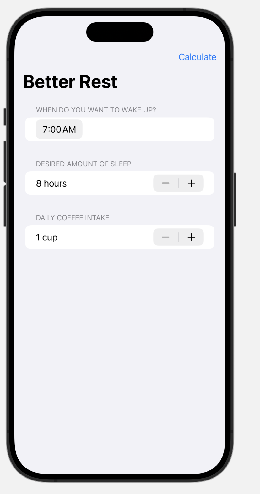

# BetterRest - Tutorial

It introduces you to one of the most powerful features of iOS development: machine learning (ML).
Core ML, a technology built into all iPhones, empowers us to create code that can make predictions based on data it has learned from.

BetterRest is designed to help coffee drinkers get a good night's sleep. 😴

## Features

- **Form:** Learn how to create a form to get user input
- **CoreML:** Explore the using of CoreML to make some predictions
- **Date:** Learn how to manage dates ando formats in SwiftUI

## Screenshots

## Technologies
- 💻 Swift
- 🖌️ SwiftUI
- 📈 Core ML
## Documentation

[Core ML](https://developer.apple.com/documentation/coreml)

## Support

For support, email montserrat.ga95@gmail.com

## License

[MIT](https://choosealicense.com/licenses/mit/)

